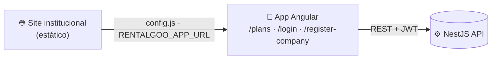

<div align="center">

# 🌐 RentalGoo — Site Institucional

### Landing page de marketing da plataforma RentalGoo

[](https://developer.mozilla.org/docs/Web/HTML)
[](https://developer.mozilla.org/docs/Web/CSS)
[](https://developer.mozilla.org/docs/Web/JavaScript)
[](https://getbootstrap.com)
[](assets/js/translations.json)
[](forms/)

</div>

> Parte do monorepo **RentalGoo**. Para a visão global do projeto, ver o [README da raiz](../README.md).

---

## 📑 Índice

- [Visão geral](#-visão-geral)
- [Estrutura](#-estrutura)
- [Como correr](#-como-correr)
- [Integração com a app](#-integração-com-a-app)
- [Multi-idioma (i18n)](#-multi-idioma-i18n)
- [Formulários](#-formulários)
- [Deploy](#-deploy)
- [Troubleshooting](#-troubleshooting)

---

## 🔭 Visão geral

Site estático (HTML/CSS/JS *vanilla*, sem build) que apresenta a plataforma RentalGoo e
encaminha os visitantes para a **aplicação Angular** (registo, planos, login). Baseado num
template Bootstrap, com animações AOS, galeria GLightbox e portfólio Isotope.

| | |
|---|---|
| **Páginas** | `index.html` (homepage) · `about.html` (sobre) |
| **Idiomas** | 🇵🇹 Português · 🇬🇧 Inglês |
| **Integração** | CTAs apontam para a app via `assets/js/config.js` |
| **Build** | Nenhum — ficheiros servidos tal como estão |

---

## 🗂 Estrutura

```
rentalgoo/
├── index.html              homepage
├── about.html              página "Sobre"
├── assets/
│   ├── css/                main.css · auth.css · register.css
│   ├── img/                logo, favicon, portfolio, etc.
│   ├── js/
│   │   ├── config.js       🔌 ponto de integração com a app Angular
│   │   ├── translations.json   textos PT / EN
│   │   ├── idioma.js       troca de idioma (i18n)
│   │   ├── main.js         comportamento do template
│   │   ├── portf.js        filtro de portfólio
│   │   └── depoi.js        depoimentos
│   ├── pdf/                Termos & Condições · Política de Privacidade
│   └── vendor/             bootstrap, bootstrap-icons, aos, glightbox,
│                           isotope-layout, imagesloaded, php-email-form
└── forms/                  contact.php · newsletter.php (backend dos formulários)
```

---

## ▶️ Como correr

Por ser estático, basta servir a pasta com qualquer servidor HTTP:

```bash
# Opção 1 — Python
python -m http.server 8080

# Opção 2 — Node
npx serve .

# Opção 3 — VS Code: extensão "Live Server"
```

Depois abrir `http://localhost:8080`.

> ⚠️ Os **formulários PHP** (`forms/`) precisam de um servidor com PHP para funcionarem
> (ex.: `php -S localhost:8080`). Com servidores estáticos, as páginas carregam mas o envio falha.

---

## 🔌 Integração com a app

Todo o acoplamento à aplicação Angular vive em [`assets/js/config.js`](assets/js/config.js):

```js
window.RENTALGOO_APP_URL = 'http://localhost:4200'; // dev
// prod: 'https://app.rentalgoo.com'

window.RENTALGOO_PLANS_MAX = 3; // nº de planos embebidos na homepage
```

No carregamento da página, o `config.js` reescreve os CTAs de registo/login para apontarem
ao `RENTALGOO_APP_URL` (os botões de registo vão primeiro para `/plans`, pois é preciso
escolher um plano antes do signup). **Para mudar de ambiente, edita apenas este ficheiro.**



---

## 🌍 Multi-idioma (i18n)

Os textos vivem em [`assets/js/translations.json`](assets/js/translations.json) (chaves `pt` e `en`)
e são aplicados por [`assets/js/idioma.js`](assets/js/idioma.js) aos elementos com atributos de
tradução. Para acrescentar/editar texto, alterar as **duas** entradas de idioma com a mesma chave.

---

## 📨 Formulários

| Ficheiro | Função |
|----------|--------|
| `forms/contact.php` | Formulário de contacto |
| `forms/newsletter.php` | Subscrição de newsletter |

Usam a biblioteca `php-email-form` (em `assets/vendor/`). Configurar o email de destino e o
SMTP dentro de cada `.php`. Sem PHP no servidor, o envio não funciona.

---

## 🚀 Deploy

Como é 100% estático, pode ir para qualquer hosting de ficheiros (Netlify, Vercel, S3+CloudFront,
Nginx/Apache...). Antes do deploy:

1. Editar `RENTALGOO_APP_URL` em `assets/js/config.js` para o URL de **produção** da app.
2. Garantir suporte a **PHP** caso queiras os formulários funcionais (senão, ligar a um serviço
   externo de formulários ou à API).

---

## 🛠 Troubleshooting

| Sintoma | Causa | Solução |
|---------|-------|---------|
| Botões de registo/login não vão para a app | `RENTALGOO_APP_URL` errado ou app em baixo | Editar `config.js` e confirmar a app a correr |
| Formulários não enviam | Servidor sem PHP | Servir com PHP (`php -S`) ou apontar a outro backend |
| Texto não muda de idioma | Chave em falta em `translations.json` | Adicionar a chave nas secções `pt` **e** `en` |
| Imagens/CSS a 404 | Caminhos relativos abertos via `file://` | Servir por HTTP, não abrir o HTML diretamente |

---

<div align="center"><sub>RentalGoo · Site institucional estático</sub></div>
